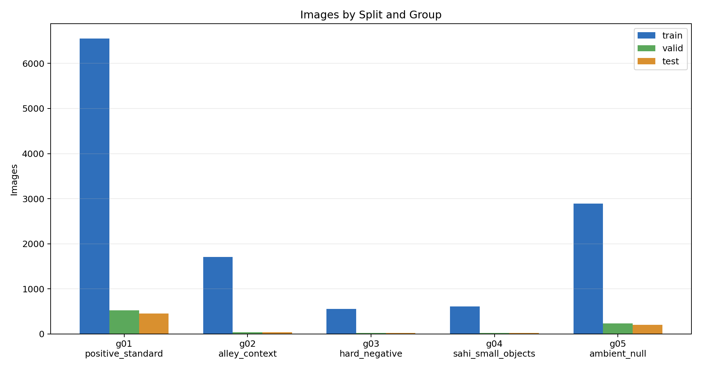
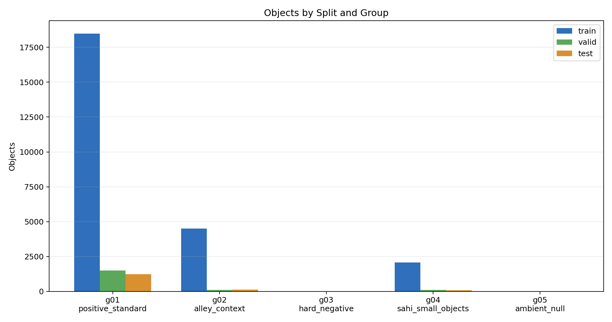
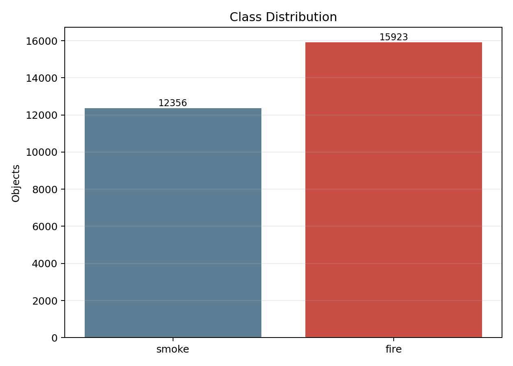
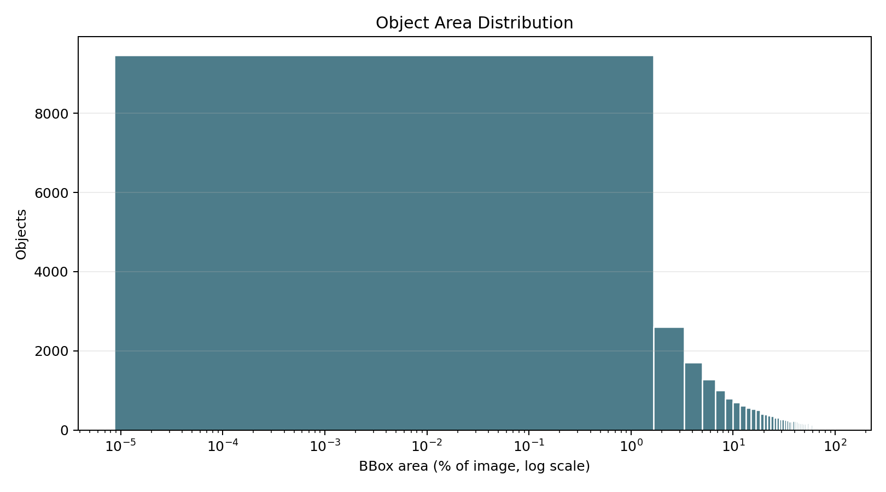
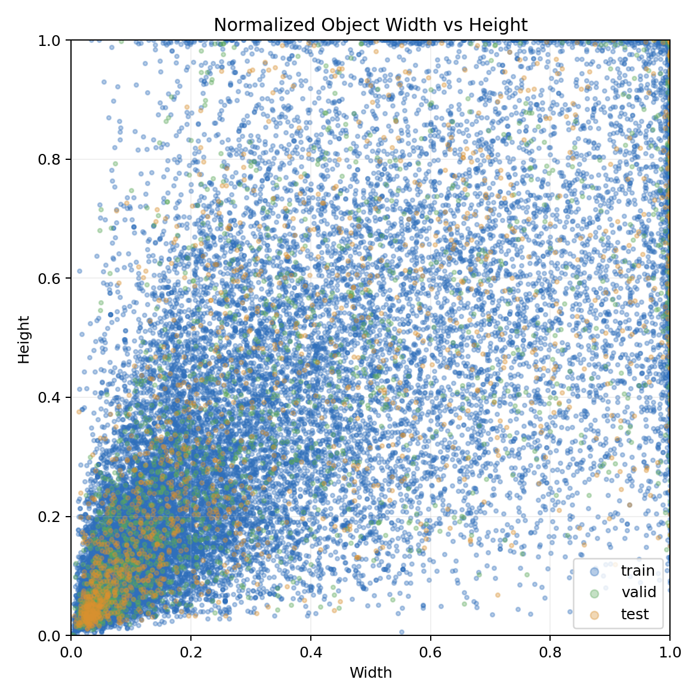
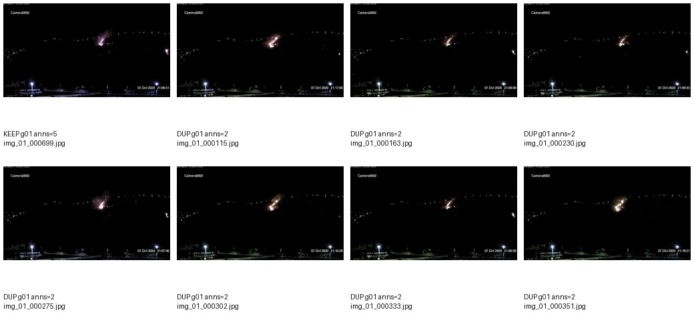
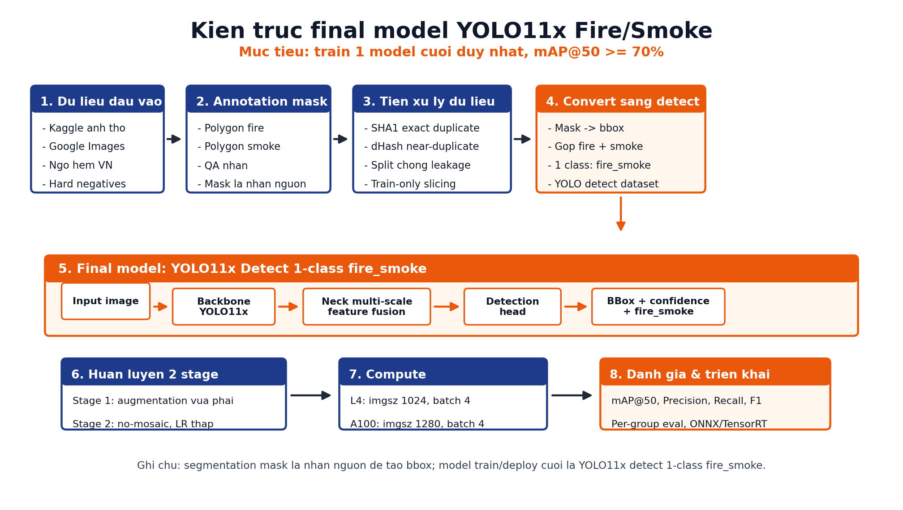

# Báo Cáo Kỹ Thuật: Xây Dựng Hệ Thống Nhận Diện Lửa Và Khói Bằng Computer Vision

## Tóm Tắt

Dự án xây dựng một pipeline Computer Vision end-to-end cho bài toán phát hiện lửa và khói trong bối cảnh thị giác đa dạng tại Việt Nam. Khác với các bộ dữ liệu cháy rừng hoặc cảnh cháy rõ ràng, dữ liệu của dự án bao gồm nhiều tình huống khó hơn: ngõ hẻm, khu dân cư, đốm lửa nhỏ, khói mờ, ánh sáng ban đêm, vật thể gây nhiễu và ảnh nền không có sự cố.

Điểm trọng tâm của dự án không chỉ nằm ở mô hình Deep Learning, mà nằm ở toàn bộ quy trình Data Mining: thu thập dữ liệu, tự xây dựng annotation segmentation, kiểm soát chất lượng nhãn, phát hiện duplicate/near-duplicate, chia tập chống leakage, oversampling có kiểm soát cho nhóm dữ liệu hiếm, và tạo báo cáo phân tích dữ liệu có thể truy vết.

Pipeline hiện tại tập trung vào **một mô hình cuối duy nhất**:

- **YOLO11x detect 1-class `fire_smoke`**: chuyển annotation mask sang bounding box, gộp `fire` và `smoke` thành một lớp cảnh báo, tối ưu mục tiêu mAP@50 ≥ 70% và khả năng triển khai thực tế.

> **Technical note:** Kaggle dataset ban đầu chỉ cung cấp ảnh, không có segmentation mask. Vì vậy phần annotation mask là một hạng mục tự xây dựng, không phải dữ liệu có sẵn.

---

## 1. Giới Thiệu Dự Án

### 1.1 Bài Toán

Bài toán cần giải quyết là phát hiện sớm dấu hiệu lửa và khói từ ảnh/camera. Đây là một bài toán khó hơn object detection thông thường vì đối tượng cần nhận diện có đặc tính thị giác không ổn định:

- Lửa có hình dạng biến đổi liên tục, biên không cố định.
- Khói có độ trong suốt, dễ hòa vào nền.
- Vùng cháy có thể rất nhỏ so với ảnh.
- Nhiều nguồn sáng nhân tạo, đèn, nến, phản chiếu có màu gần giống lửa.
- Ảnh từ camera thực tế có nhiễu, watermark, timestamp, nén mạnh và độ phân giải không đồng nhất.

### 1.2 Ý Nghĩa Thực Tiễn

Một hệ thống phát hiện lửa/khói có thể hỗ trợ:

- Cảnh báo sớm trong khu dân cư, nhà xưởng, kho bãi.
- Giám sát camera an ninh hiện có mà không cần cảm biến chuyên dụng.
- Phân tích hậu kiểm sự kiện cháy.
- Xây dựng module AI phục vụ hệ thống an toàn đô thị hoặc IoT.

### 1.3 Vì Sao Segmentation Phù Hợp

Detection chỉ trả về bounding box, trong khi segmentation cung cấp vùng mask chi tiết của lửa/khói. Với bài toán này, segmentation hữu ích vì:

- Giữ thông tin hình dạng của ngọn lửa/khói.
- Giúp chuyển đổi linh hoạt sang detection bằng bounding box.
- Cho phép đánh giá chất lượng biên vùng sự cố.
- Hữu ích cho các bước hậu xử lý như tính diện tích cháy, theo dõi vùng lan rộng hoặc lọc false positive theo hình dạng.

Tuy nhiên, segmentation có chi phí annotation và inference cao. Vì vậy dự án tách rõ vai trò giữa **nhãn dữ liệu** và **mô hình cuối**:

- Dữ liệu gốc được gán nhãn segmentation để giữ độ giàu thông tin.
- Mô hình cuối chỉ là YOLO11x detect 1-class để đạt tốc độ, tính ổn định và mục tiêu mAP@50 ≥ 70%.

### 1.4 Mục Tiêu Hệ Thống

Mục tiêu của hệ thống:

- Xây dựng dataset lửa/khói có kiểm soát chất lượng.
- Tự annotation mask cho dữ liệu không có nhãn segmentation.
- Huấn luyện mô hình có khả năng phát hiện trong nhiều bối cảnh thực tế.
- Giảm rủi ro data leakage do ảnh trùng hoặc frame quá giống nhau.
- Tạo pipeline có thể lặp lại: prepare dataset, train, evaluate, fine-tune, upload artifact.
- Tạo artifact phân tích dữ liệu phục vụ báo cáo học thuật và portfolio kỹ thuật.

---

## 2. Thu Thập Dữ Liệu

### 2.1 Nguồn Dữ Liệu

Dữ liệu được tổng hợp từ nhiều nguồn để tránh mô hình chỉ học một kiểu cháy duy nhất.

| Nguồn | Đặc điểm | Vấn đề chính |
|---|---|---|
| Kaggle | Có ảnh lửa/khói, đa dạng cảnh | Chỉ có ảnh, không có segmentation mask |
| Google Images | Bổ sung ảnh ngữ cảnh dân dụng, lửa nhỏ, khói mờ | Nhiễu, watermark, duplicate, chất lượng không đồng đều |
| Dữ liệu tự thu thập/chọn lọc | Bổ sung bối cảnh thực tế Việt Nam như ngõ hẻm, khu dân cư | Cần chuẩn hóa và tự gán nhãn |
| Nhóm hard negative | Ảnh dễ gây nhầm: ánh đèn, nến, phản chiếu, nền tối | Cần giữ làm background để giảm false positive |

Dataset được tổ chức thành 5 nhóm:

| Group | Tên | Vai trò |
|---|---|---|
| g01 | `positive_standard` | Ảnh positive chuẩn, nhiều mẫu lửa/khói |
| g02 | `alley_context` | Bối cảnh ngõ hẻm/khu dân cư, khó và ít dữ liệu |
| g03 | `hard_negative` | Ảnh âm tính khó, dùng để giảm false positive |
| g04 | `sahi_small_objects` | Đối tượng nhỏ, dùng slicing để tăng mẫu học |
| g05 | `ambient_null` | Ảnh nền bình thường, gần như không có lửa/khói |

### 2.2 Vấn Đề Thực Tế Khi Thu Thập Dữ Liệu

Dữ liệu thực tế không sạch theo kiểu textbook. Các vấn đề chính gồm:

- Ảnh có độ phân giải khác nhau, từ ảnh nhỏ đến ảnh HD.
- Một số ảnh có watermark, timestamp camera hoặc logo.
- Nhiều ảnh có compression artifact, noise ban đêm, motion blur.
- Một số cảnh cháy rất giống nhau do lấy từ video/frame sequence.
- Dữ liệu positive áp đảo so với nhóm hard negative và small object.
- Nhãn gốc không đồng nhất giữa các nguồn.
- Kaggle chỉ có ảnh, không có mask segmentation.

> **Insight:** Với bài toán lửa/khói, duplicate không chỉ là ảnh giống hệt byte-level. Nhiều ảnh có cùng cảnh cháy nhưng khác frame, khác nén hoặc crop nhẹ. Nếu không xử lý, mô hình có thể học thuộc scene thay vì học đặc trưng cháy.

### 2.3 Tự Xây Dựng Annotation Segmentation

Vì dataset Kaggle ban đầu chỉ có ảnh, toàn bộ segmentation mask phải được tự xây dựng.

Workflow annotation được thiết kế theo hướng production:

1. **Import ảnh vào công cụ annotation segmentation**
   - Dữ liệu được gom theo nhóm ngữ cảnh.
   - Ảnh lỗi, ảnh quá nhỏ hoặc ảnh không liên quan được loại ở bước sơ bộ.

2. **Tạo polygon/mask cho vùng lửa và khói**
   - Vùng lửa được gán nhãn theo phần phát sáng/cháy thực tế.
   - Vùng khói được gán nhãn khi có cấu trúc khói rõ ràng.
   - Tránh gán nhãn toàn bộ vùng sáng nếu đó chỉ là phản chiếu hoặc đèn.

3. **Quy chuẩn gán nhãn**
   - Không gán nhãn watermark, timestamp, text overlay.
   - Với lửa bị che một phần, chỉ annotate phần nhìn thấy.
   - Với khói mờ, chỉ annotate khi ranh giới còn đủ thông tin thị giác.
   - Với ảnh có nhiều đốm lửa nhỏ, mỗi vùng được annotate riêng nếu tách biệt rõ.
   - Với vật thể như nến hoặc đèn, chỉ annotate nếu mục tiêu dataset xem đó là fire; nếu dùng làm hard negative thì giữ background.

4. **QA annotation**
   - Kiểm tra ảnh có mask nằm ngoài biên.
   - Kiểm tra polygon quá nhỏ hoặc bị lỗi hình học.
   - Kiểm tra class id nhất quán.
   - Kiểm tra ảnh positive nhưng không có label.
   - Kiểm tra ảnh negative bị gán nhãn nhầm.

5. **Export COCO-seg**
   - Dữ liệu từ các nhóm được export ở dạng COCO segmentation.
   - Pipeline nội bộ chuyển COCO-seg sang YOLO segmentation format.

### 2.4 Khó Khăn Khi Self-Labeling

Annotation segmentation là phần tốn công nhất của dự án:

- Biên lửa không rõ vì lửa có vùng sáng lan dần.
- Khói thường mờ, bán trong suốt và dễ hòa vào nền.
- Ảnh đêm có nhiều nguồn sáng giả.
- Một số đốm lửa nhỏ chỉ vài pixel, polygon dễ sai.
- Nếu annotate quá rộng, mô hình học cả background.
- Nếu annotate quá chặt, mô hình mất recall ở vùng cháy lan/mờ.

> **Engineering trade-off:** Annotation quá chi tiết làm tăng chi phí và nhiễu giữa annotator; annotation quá thô làm mask kém giá trị. Dự án chọn mức chi tiết đủ để mô hình học vùng fire/smoke chính, đồng thời giữ pipeline chuyển sang detection ổn định.

---

## 3. Phân Tích Dữ Liệu EDA

EDA được tự động hóa bằng script:

```bash
python scripts/generate_yolo11_data_report.py \
  --dataset datasets/fire_vn_yolo11seg_v1 \
  --output reports/data_audit_deduped
```

Các artifact chính:

- [Data audit summary](data_audit_deduped/data_audit_summary.md)
- [Images by split/group](data_audit_deduped/figures/images_by_split_group.png)
- [Objects by split/group](data_audit_deduped/figures/objects_by_split_group.png)
- [Class distribution](data_audit_deduped/figures/class_distribution.png)
- [Object area distribution](data_audit_deduped/figures/object_area_distribution.png)
- [Object width-height scatter](data_audit_deduped/figures/object_width_height_scatter.png)
- [Image resolution distribution](data_audit_deduped/figures/image_resolution_distribution.png)
- [Sample montage g04](data_audit_deduped/samples/train_g04_sahi_small_objects_samples.jpg)

### 3.1 Tổng Quan Dataset Sau Tiền Xử Lý

Sau khi loại near-duplicate và rebuild dataset:

| Chỉ số | Giá trị |
|---|---:|
| Tổng ảnh | 13,896 |
| Tổng object segmentation | 28,279 |
| Background images | 4,099 |
| Background ratio | 29.50% |
| `smoke` objects | 12,356 |
| `fire` objects | 15,923 |

### 3.1.1 So Sánh Trước Và Sau Tiền Xử Lý

Để phục vụ yêu cầu Data Mining, dataset không chỉ được mô tả ở trạng thái cuối mà còn được ghi nhận theo từng giai đoạn xử lý. Bảng dưới đây cho thấy tác động định lượng của preprocessing lên tập dữ liệu detection được dùng cho mô hình cảnh báo cuối.

| Giai đoạn dữ liệu | Images | Objects | Ghi chú |
|---|---:|---:|---|
| Trước near-dedupe | 15,615 | 31,134 | Dataset sau slicing/convert detect nhưng chưa loại near-duplicate |
| Sau near-dedupe | 13,896 | 28,279 | Dataset final dùng để train/evaluate |
| Mức thay đổi | -1,719 | -2,855 | Giảm mẫu trùng/lặp cảnh và object lặp lại theo frame |

Ở mức source image, bộ lọc duplicate/near-duplicate phát hiện `1,095` cụm ảnh gần trùng và loại `1,649` ảnh nguồn. Chênh lệch giữa số ảnh nguồn bị loại và số ảnh detection-level giảm sau convert đến từ việc một ảnh nguồn có thể sinh nhiều slice trong train split, đặc biệt ở các nhóm g02/g03/g04.

| Nhóm | Ảnh nguồn bị loại | Ý nghĩa |
|---|---:|---|
| g01 positive_standard | 1,518 | Giảm mạnh các frame/cảnh cháy lặp lại, hạn chế học thuộc scene |
| g02 alley_context | 20 | Giữ phần lớn dữ liệu ngõ hẻm vì nhóm này hiếm |
| g03 hard_negative | 9 | Giữ hard negative để giảm false positive |
| g04 sahi_small_objects | 0 | Không làm mất nhóm object nhỏ vốn rất ít |
| g05 ambient_null | 102 | Giảm ảnh nền quá giống nhau |

> **Insight:** Số ảnh sau xử lý thấp hơn không có nghĩa dataset yếu đi. Với bài toán này, việc giảm ảnh gần trùng giúp metric bớt ảo và buộc mô hình học đặc trưng lửa/khói thay vì học thuộc background của cùng một video hoặc cùng một camera.

### 3.2 Phân Bố Theo Split

| Split | Images | Objects | Background images |
|---|---:|---:|---:|
| Train | 12,322 | 25,086 | 3,628 |
| Valid | 841 | 1,724 | 252 |
| Test | 733 | 1,469 | 219 |

### 3.3 Phân Bố Theo Nhóm Dữ Liệu

| Split | Group | Images | Objects | Background ratio |
|---|---|---:|---:|---:|
| Train | g01 positive_standard | 6,552 | 18,479 | 0.00 |
| Train | g02 alley_context | 1,711 | 4,498 | 0.1099 |
| Train | g03 hard_negative | 555 | 0 | 1.0000 |
| Train | g04 sahi_small_objects | 612 | 2,086 | 0.0000 |
| Train | g05 ambient_null | 2,892 | 23 | 0.9976 |
| Valid | g01 positive_standard | 527 | 1,511 | 0.0000 |
| Valid | g02 alley_context | 42 | 105 | 0.0000 |
| Valid | g03 hard_negative | 19 | 0 | 1.0000 |
| Valid | g04 sahi_small_objects | 20 | 108 | 0.0000 |
| Valid | g05 ambient_null | 233 | 0 | 1.0000 |
| Test | g01 positive_standard | 452 | 1,245 | 0.0000 |
| Test | g02 alley_context | 42 | 132 | 0.0000 |
| Test | g03 hard_negative | 19 | 0 | 1.0000 |
| Test | g04 sahi_small_objects | 20 | 92 | 0.0000 |
| Test | g05 ambient_null | 200 | 0 | 1.0000 |





### 3.4 Insight Từ EDA

Các vấn đề quan trọng phát hiện được:

- Group g01 vẫn chiếm tỷ trọng lớn, nhưng đã giảm đáng kể sau near-dedupe.
- Group g03 và g05 là nguồn background quan trọng để giảm false positive.
- Group g04 có số ảnh thấp nhưng mật độ object cao, phù hợp để học small object.
- Valid/test giữ ảnh gốc, không slicing, giúp đánh giá trung thực hơn.
- Background ratio toàn dataset là 29.50%, đủ để mô hình học negative context mà không bị background áp đảo.







> **Insight:** Với bài toán fire/smoke, recall trên object nhỏ và precision trên hard negative thường quan trọng hơn việc chỉ tối đa hóa mAP tổng. Vì vậy EDA không chỉ đếm tổng ảnh, mà tách theo nhóm nguồn dữ liệu để biết mô hình yếu ở đâu.

---

## 4. Làm Sạch Và Xử Lý Dữ Liệu

### 4.1 Pipeline Chuẩn Bị Dữ Liệu

Pipeline được hiện thực trong:

- `scripts/prepare_yolo11_seg_dataset.py`
- `scripts/prepare_yolo11_detect_dataset.py`
- `scripts/generate_yolo11_data_report.py`

Pseudo workflow:

```text
Raw image groups
  -> extract Roboflow/COCO exports
  -> normalize filenames
  -> collect source images and COCO annotations
  -> compute content hash
  -> exact + perceptual duplicate audit
  -> deterministic split by source image
  -> train-only slicing for minority groups
  -> COCO merge
  -> YOLO segmentation labels
  -> optional conversion to YOLO detection labels
  -> data audit charts and sample visualization
```

### 4.2 Xóa Ảnh Trùng Lặp Và Near-Duplicate

Dự án sử dụng hai mức kiểm tra:

1. **Exact duplicate**
   - SHA1 theo nội dung file ảnh.
   - Phát hiện ảnh giống hệt byte-level.

2. **Near-duplicate**
   - Perceptual hashing bằng dHash 64-bit.
   - Dùng Hamming distance threshold `<= 2`.
   - Phù hợp để bắt ảnh cùng scene nhưng khác nén/crop/frame nhẹ.

Kết quả preprocessing:

| Chỉ số | Giá trị |
|---|---:|
| Duplicate clusters | 1,095 |
| Source images removed | 1,649 |
| Kept source images in duplicate clusters | 1,095 |
| g01 removed | 1,518 |
| g02 removed | 20 |
| g03 removed | 9 |
| g05 removed | 102 |

Ảnh audit near-duplicate:



> **Warning:** Near-duplicate removal có thể xóa các frame giống nhau nhưng vẫn chứa biến thiên nhỏ về lửa. Vì vậy threshold được giữ ở mức bảo thủ `2`, không dùng `4`, để tránh làm mất đa dạng dữ liệu.

### 4.2.1 Tác Động Của Preprocessing Đến mAP

Preprocessing hiện tại được thiết kế để cải thiện **mAP thật** và khả năng tổng quát hóa, không chỉ làm đẹp chỉ số trên validation/test. Tác động kỳ vọng theo từng kỹ thuật:

| Kỹ thuật | Tác động lên training | Tác động kỳ vọng lên metric |
|---|---|---|
| Exact duplicate removal | Loại ảnh giống hệt byte-level | Giảm leakage và giảm overfitting |
| Near-duplicate removal bằng dHash | Loại frame/cảnh gần giống nhau | mAP validation có thể giảm nhẹ nhưng test thực tế đáng tin hơn |
| Split trước slicing | Đảm bảo crop từ cùng ảnh nguồn không rơi vào nhiều split | Metric trung thực hơn, tránh inflate |
| Slicing train-only g02/g04 | Tăng số mẫu cho ngữ cảnh hiếm và object nhỏ | Tăng recall ở alley context/small object |
| Giữ hard negative g03/g05 | Dạy mô hình phân biệt đèn, phản chiếu, nền tối | Tăng precision, giảm false positive |
| Giảm mosaic/scale | Hạn chế làm mất tín hiệu lửa nhỏ | Tăng recall và ổn định localization |
| Fine-tune no-mosaic | Đưa phân phối train gần ảnh thật hơn | Tăng F1/mAP test nếu mô hình chưa overfit |

Điểm cần lưu ý là preprocessing có thể làm chỉ số trên validation thấp hơn so với bản chưa lọc nếu bản cũ có nhiều frame gần trùng giữa các split. Tuy nhiên đó là sự giảm của **metric ảo**, không phải giảm chất lượng hệ thống. Với một bài toán cảnh báo an toàn, mô hình có khả năng tổng quát hóa tốt trên camera/cảnh mới quan trọng hơn việc đạt mAP cao trên tập đánh giá bị leakage.

> **Engineering decision:** Dataset final ưu tiên tính trung thực và khả năng triển khai. Vì vậy near-dedupe threshold được đặt bảo thủ ở `2`, valid/test giữ ảnh gốc, và mọi kỹ thuật oversampling/slicing chỉ áp dụng cho train split.

### 4.3 Loại Bỏ Ảnh Lỗi Và Chuẩn Hóa

Trong quá trình prepare dataset:

- Ảnh không đọc được kích thước bị bỏ qua.
- Ảnh thiếu file so với annotation bị cảnh báo.
- File name được chuẩn hóa để tránh lỗi Windows path length.
- COCO category được remap thống nhất.
- YOLO labels được validate để tránh tọa độ ngoài `[0, 1]`.

### 4.4 Slicing Cho Nhóm Dữ Liệu Hiếm

Chỉ train split được slicing; valid/test giữ ảnh gốc để tránh inflate metric.

| Group | Slice size | Overlap | Negative handling |
|---|---:|---:|---|
| g02 alley_context | 640 | 0.40 | giữ negative có cap |
| g03 hard_negative | 640 | 0.40 | giữ empty slices, cap 8/source |
| g04 sahi_small_objects | 416 | 0.50 | bỏ empty slices |

Rationale:

- g02 cần tăng mẫu alley context nhưng không làm dataset phình quá mức.
- g03 là hard negative, cần đủ background khó nhưng không được áp đảo.
- g04 chứa small object; giảm slice size xuống 416 giúp object nhỏ chiếm tỷ lệ lớn hơn trong crop.

### 4.5 Train/Validation/Test Split Và Leakage Prevention

Split được thực hiện trước slicing. Mọi crop sinh ra từ một ảnh nguồn chỉ nằm trong train nếu ảnh nguồn thuộc train.

Các biện pháp chống leakage:

- Split theo source image, không split theo crop.
- Kiểm tra `content_hash` để tránh ảnh trùng rơi vào các split khác nhau.
- Dedupe trước split để giảm nguy cơ mô hình học thuộc scene.
- Valid/test không slicing để giữ phân phối đánh giá gần thực tế hơn.

> **Engineering trade-off:** Slicing làm tăng recall trên object nhỏ nhưng có thể làm phân phối train khác valid/test. Vì vậy slicing chỉ áp dụng cho train, còn valid/test giữ ảnh nguyên bản để metric không bị dễ hóa.

### 4.6 Augmentation

Augmentation trong YOLO11 được điều chỉnh cho bài toán fire/smoke:

- Mosaic giảm xuống `0.40` ở main train.
- Scale giảm xuống `0.35` để hạn chế làm mất object nhỏ.
- MixUp giữ rất thấp `0.02` hoặc tắt ở fine-tune.
- Fine-tune no-mosaic để mô hình nhìn ảnh gần phân phối thật.
- HSV giữ vừa phải vì màu lửa là tín hiệu quan trọng.

---

## 5. Kiến Trúc Mô Hình

### 5.1 Kiến Trúc Chính

Mô hình chính và cũng là mô hình cuối của pipeline là **YOLO11x detection 1-class `fire_smoke`**. Annotation ban đầu được xây dựng ở dạng segmentation mask để giữ thông tin vùng cháy/khói, sau đó được chuyển sang bounding box để train một mô hình detection duy nhất.



Cấu trúc logic:

```text
Raw images
  -> segmentation annotation masks
  -> data cleaning + leakage-safe split + train-only slicing
  -> mask-to-box conversion
  -> YOLO11x backbone
  -> multi-scale feature fusion neck
  -> detection head
  -> bbox + confidence + fire_smoke
  -> NMS / thresholding
```

### 5.2 Vì Sao Không Train Segmentation Làm Mô Hình Cuối

U-Net, DeepLabV3+, SegFormer hoặc Attention U-Net phù hợp cho semantic segmentation, đặc biệt trong y tế hoặc ảnh vệ tinh. Tuy nhiên bài toán này có yêu cầu khác:

- Cần chạy nhanh trên camera hoặc batch inference.
- Cần phát hiện object ở nhiều scale.
- Cần output có thể dùng trực tiếp cho cảnh báo.
- Cần tận dụng pretrained weights từ hệ sinh thái YOLO.

Do đó, mô hình cuối không đi theo hướng semantic segmentation. Segmentation chỉ được dùng ở tầng dữ liệu để tạo annotation giàu thông tin. Khi chuyển sang bài toán cảnh báo, YOLO11x detect 1-class thực dụng hơn vì:

- Tối ưu trực tiếp metric detection như Precision, Recall, F1, mAP@50.
- Bỏ confusion giữa `fire` và `smoke` bằng cách gộp thành `fire_smoke`.
- Tốc độ inference và hậu xử lý đơn giản hơn mask segmentation.
- Phù hợp mục tiêu chính của dự án: một model cuối đạt mAP@50 ≥ 70%.

### 5.3 Backbone, Neck, Head

| Thành phần | Vai trò |
|---|---|
| Backbone | Trích xuất đặc trưng thị giác từ ảnh, học texture, màu, vùng sáng, khói |
| Neck | Kết hợp đặc trưng nhiều scale để xử lý object nhỏ và lớn |
| Detection head | Dự đoán bbox, confidence, class |

### 5.4 Transfer Learning

Mô hình dùng pretrained weights:

- `yolo11x.pt` cho detection.

Rationale:

- Dataset không đủ lớn để train from scratch.
- Pretrained backbone đã học edge, texture, objectness từ dữ liệu lớn.
- Fine-tune giúp thích nghi với domain fire/smoke Việt Nam.

### 5.5 Trade-off Tốc Độ Và Độ Chính Xác

| Model | Ưu điểm | Nhược điểm | Vai trò |
|---|---|---|---|
| YOLO11s/m | Nhanh, nhẹ | mAP thấp hơn với object nhỏ | baseline |
| YOLO11x detect | Backbone mạnh, tốt cho mAP và object nhỏ | nặng hơn YOLO11s/m | final alerting model |

> **Decision:** Với mục tiêu cảnh báo, detection 1-class `fire_smoke` từ mask segmentation là hướng thực dụng: tận dụng annotation giàu thông tin nhưng deployment nhẹ và ổn định hơn segmentation mask full.

---

## 6. Chiến Lược Huấn Luyện

### 6.1 Detection Final: Two-Stage Training

Script chính:

```bash
bash scripts/run_vertex_detect_final.sh
```

Stage 1: main train

| Tham số | Giá trị |
|---|---:|
| Model | `yolo11x.pt` |
| Image size | 1024 |
| Epochs | 180 |
| Batch | 4 |
| Optimizer | AdamW |
| LR | 0.0005 |
| Scheduler | Cosine LR |
| Warmup | 4 epochs |
| Patience | 45 |
| Mosaic | 0.40 |
| MixUp | 0.02 |
| Scale | 0.35 |
| AMP | True |
| Cache | disk |

Stage 2: fine-tune

| Tham số | Giá trị |
|---|---:|
| Init weights | Stage 1 `best.pt` |
| Image size | 1024 |
| Epochs | 60 |
| Batch | 4 |
| LR | 0.00008 |
| Warmup | 1 epoch |
| Mosaic | 0.0 |
| MixUp | 0.0 |
| Scale | 0.20 |
| Patience | 20 |

Rationale:

- Stage 1 dùng augmentation để tăng robustness.
- Stage 2 tắt mosaic/mixup để mô hình học lại phân phối ảnh thật.
- LR thấp giúp refine boundary/box mà không phá pretrained representation.

### 6.2 Loss Và Loss Weighting

Detection profile dùng:

| Thành phần | Giá trị |
|---|---:|
| `box` | 8.0 |
| `cls` | 0.35 |
| `dfl` | 1.5 |
| `single_cls` | True |

Giải thích:

- Bài toán deployment gộp `fire` và `smoke` thành `fire_smoke`, nên `single_cls=True`.
- Class loss giảm vì chỉ có một class.
- Box loss tăng để ưu tiên localization.
- DFL giữ mặc định ổn định cho bbox quality.

### 6.3 Vai Trò Của Segmentation Trong Pipeline

Dự án **không train hai mô hình cuối**. Segmentation xuất hiện ở pipeline vì dữ liệu được tự gán nhãn bằng polygon/mask, sau đó mask được chuyển thành bounding box để train YOLO11x detect.

| Thành phần | Vai trò trong dự án |
|---|---|
| Segmentation mask | Nhãn nguồn giàu thông tin, giúp khoanh chính xác vùng lửa/khói khi annotation |
| Mask-to-box conversion | Chuyển vùng mask thành bbox để train detection |
| YOLO11x detect | Mô hình cuối duy nhất, tối ưu mAP@50 ≥ 70% |

Cách làm này giữ lợi ích của annotation segmentation nhưng tránh chi phí inference và độ phức tạp của segmentation model khi triển khai cảnh báo.

### 6.4 Checkpointing Và Reproducibility

Pipeline lưu:

- `best.pt`
- `last.pt`
- `results.csv`
- `args.yaml`
- `training_config.json`
- confusion matrix/curves nếu có

Seed mặc định:

```text
seed = 42
deterministic = True
```

---

## 7. Hạ Tầng Và Tài Nguyên Tính Toán

### 7.1 GPU Mục Tiêu

Pipeline được thiết kế để chạy trên:

- NVIDIA L4
- NVIDIA A100 40GB

Trong cấu hình hiện tại, L4 là target chính để tối ưu cost/performance ở mức thực tế. A100 40GB phù hợp khi cần thử nghiệm nhanh, tăng image size, batch size hoặc chạy nhiều profile.

### 7.2 L4

Ưu điểm:

- Chi phí hourly thấp hơn A100.
- Phù hợp với YOLO11x detect `imgsz=1024`, batch 4.
- Phù hợp cho fine-tune và training production vừa phải.

Nhược điểm:

- VRAM giới hạn hơn.
- Segmentation YOLO11x phải giảm `imgsz` hoặc batch.
- Thời gian train dài hơn.

### 7.3 A100 40GB

Ưu điểm:

- VRAM lớn, có thể tăng batch size/image size.
- Training nhanh hơn đáng kể.
- Ít phải hy sinh cấu hình model.
- Hữu ích cho hyperparameter search và ablation.

Nhược điểm:

- Chi phí hourly cao hơn.

Cấu hình A100 40GB được tách thành profile riêng để không làm thay đổi profile L4:

| Profile | Model | Image size | Batch | Epochs | Vai trò |
|---|---|---:|---:|---:|---|
| `vertex_detect_a100` | `yolo11x.pt` | 1280 | 4 | 180 | Main train accuracy-first |
| `vertex_detect_finetune_a100` | Stage 1 `best.pt` | 1280 | 4 | 60 | Fine-tune no-mosaic |

So với L4, A100 không chỉ giúp train nhanh hơn mà còn cho phép tăng `imgsz` từ `1024` lên `1280`. Với fire/smoke, điểm này quan trọng vì nhiều vùng lửa/khói nhỏ có thể bị mất chi tiết ở image size thấp. Batch mặc định giữ ở `4` để giảm rủi ro OOM trên A100 40GB; nếu theo dõi `nvidia-smi` thấy VRAM còn dư, có thể thử tăng `BATCH=6` hoặc `BATCH=8`.

> **Technical note:** A100 profile vẫn dùng chiến lược 2-stage giống L4: stage 1 có augmentation vừa phải, stage 2 tắt mosaic/mixup để refine trên phân phối ảnh thật.

### 7.4 Vì Sao A100 Có Thể Rẻ Hơn Về Tổng Cost

Hourly cost của A100 cao hơn, nhưng tổng cost phụ thuộc:

```text
total_cost = hourly_price x training_hours x number_of_trials
```

Nếu A100 giảm thời gian train đủ nhiều, tổng chi phí có thể thấp hơn L4. Ví dụ:

| GPU | Hourly cost | Time/trial | Total/trial |
|---|---:|---:|---:|
| L4 | thấp | dài | có thể cao nếu nhiều trial |
| A100 40GB | cao | ngắn | hiệu quả khi cần nhiều thử nghiệm |

> **Engineering trade-off:** L4 phù hợp cho final training tiết kiệm; A100 phù hợp cho giai đoạn nghiên cứu, tuning và ablation vì vòng lặp thử nghiệm nhanh hơn.

### 7.5 So Sánh Cấu Hình L4 Và A100

| Thành phần | L4 profile | A100 40GB profile | Tác động kỳ vọng |
|---|---:|---:|---|
| Main image size | 1024 | 1280 | A100 giữ nhiều chi tiết small object hơn |
| Main batch | 4 | 4 | Giữ an toàn VRAM khi tăng image size |
| Fine-tune image size | 1024 | 1280 | Đánh giá và refine ở độ phân giải cao hơn |
| Fine-tune batch | 4 | 4 | Giữ ổn định; có thể override nếu VRAM dư |
| Mosaic main train | 0.40 | 0.40 | Giữ cùng augmentation để so sánh công bằng |
| Mosaic fine-tune | 0.0 | 0.0 | Cả hai đều học lại phân phối ảnh thật |
| Mục tiêu | Cost-efficient final | Accuracy-first final/ablation | A100 phù hợp khi cần mAP cao hơn |

### 7.6 Ghi Chú Về Thời Gian Train

Tại thời điểm viết báo cáo này, repository đang chứa pipeline và dataset artifacts; thời gian train thực tế cần trích từ `results.csv` sau khi job Vertex hoàn tất. Báo cáo không ghi số thời gian giả định để tránh sai lệch kỹ thuật.

---

## 8. Đánh Giá Mô Hình

### 8.1 Metrics

Vì mô hình cuối là YOLO11x detect 1-class `fire_smoke`, evaluation tập trung vào detection metrics:

- Precision
- Recall
- F1-score
- mAP@50
- mAP@50:95

Công thức chính:

```text
Precision = TP / (TP + FP)
Recall = TP / (TP + FN)
F1 = 2 * Precision * Recall / (Precision + Recall)
```

### 8.2 Evaluation Workflow

Test split validation:

```bash
python scripts/train_yolo11_detect.py \
  --profile vertex_detect_final \
  --val-test
```

Per-group evaluation:

```bash
python scripts/evaluate_yolo11_detect_groups.py \
  --model runs/final/yolo11x_detect_fire_smoke_l4_finetune/weights/best.pt \
  --dataset datasets/fire_vn_yolo11det_fire_smoke_v2 \
  --split test \
  --imgsz 1024 \
  --overwrite
```

### 8.3 Vì Sao Cần Per-Group Evaluation

Overall mAP có thể che giấu lỗi ở nhóm dữ liệu nhỏ. Dự án tách đánh giá theo group để trả lời:

- Mô hình có nhận được lửa/khói trong ngõ hẻm không?
- Recall trên small object có thấp không?
- Hard negative có gây false positive không?
- Ambient context có bị báo cháy nhầm không?

### 8.4 Bảng Kết Quả

Kết quả định lượng sẽ được cập nhật sau khi training job hoàn tất và sinh `results.csv`.

| Metric | Validation | Test | Ghi chú |
|---|---:|---:|---|
| Precision | TBD | TBD | Từ YOLO validation |
| Recall | TBD | TBD | Quan trọng cho cảnh báo sớm |
| F1-score | TBD | TBD | Cân bằng precision/recall |
| mAP@50 | TBD | TBD | Mục tiêu chính |
| mAP@50:95 | TBD | TBD | Đánh giá localization chặt hơn |

> **Warning:** Không nên báo cáo metric trước khi training trên dataset deduped hoàn tất và sinh `results.csv`. Dataset final đã có trên Hugging Face, nhưng metric mô hình phải lấy từ job train/evaluate thật để tránh báo cáo sai lệch.

---

## 9. Phân Tích Lỗi Và Khó Khăn

### 9.1 Overfitting Do Duplicate/Frame Sequence

Vấn đề lớn nhất được phát hiện là near-duplicate. Nhiều ảnh đến từ cùng scene/camera, chỉ khác frame hoặc compression. Nếu không xử lý:

- Train/valid/test có thể chứa cảnh gần giống nhau.
- mAP bị inflate.
- Mô hình học thuộc background camera.
- Khi gặp camera mới, performance giảm.

Giải pháp:

- SHA1 exact duplicate.
- dHash near-duplicate threshold `2`.
- Split sau dedupe.
- Contact sheet để QA thủ công.

### 9.2 Noisy Labels

Noisy label đến từ:

- Khói mờ khó xác định biên.
- Lửa nhỏ dễ bị annotate thiếu.
- Nguồn sáng giả dễ bị annotate nhầm.
- Polygon quá rộng bao cả background.

Tác động:

- Mask boundary không ổn định.
- Detection box chuyển từ polygon có thể bị lệch.
- Model dễ học nhầm texture nền.

### 9.3 Object Nhỏ

Small fire/smoke có diện tích rất nhỏ trong ảnh. Nếu train trực tiếp trên ảnh lớn:

- Object chỉ chiếm vài pixel.
- Gradient yếu.
- Recall thấp.

Giải pháp:

- Slicing group g04 với size 416.
- Image size train detect 1024.
- Giảm scale augmentation.
- Fine-tune no-mosaic.

### 9.4 Background Gây Nhiễu

Các false positive phổ biến:

- Đèn vàng/cam.
- Nến.
- Phản chiếu ánh sáng.
- Bầu trời hoàng hôn.
- Vùng sáng trong ảnh đêm.

Giải pháp:

- Group g03 hard negative.
- Group g05 ambient null.
- Gộp class thành `fire_smoke` cho detection để giảm confusion nội bộ.
- Per-group evaluation trên negative groups.

### 9.5 Boundary Segmentation Khó

Vùng khói và lửa không có biên vật lý rõ. Nếu chọn segmentation làm mô hình cuối, phần biên mask sẽ rất nhạy với nhiễu annotation. Vì vậy dự án không chọn segmentation làm output triển khai; mask chỉ giữ vai trò annotation nguồn để tạo bbox chất lượng hơn cho YOLO11x detect.

---

## 10. Tối Ưu Mô Hình

### 10.1 Hyperparameter Tuning

Các chỉnh tối ưu đã áp dụng:

- Mosaic giảm từ mức cao xuống `0.40`.
- Scale giảm xuống `0.35`.
- Fine-tune stage tắt mosaic/mixup.
- LR fine-tune giảm còn `0.00008`.
- Tăng box loss weight cho detection.
- Dùng `single_cls=True` cho detection final.

### 10.2 Augmentation Tuning

Augmentation được điều chỉnh theo domain:

- Không dùng augmentation quá mạnh làm biến dạng đốm lửa nhỏ.
- Không làm lệch màu quá nhiều vì màu là tín hiệu quan trọng.
- Mosaic chỉ dùng ở main train, tắt ở fine-tune.

### 10.3 Scheduler Tuning

Cosine LR giúp learning rate giảm mượt, phù hợp với fine-tuning pretrained model. Warmup tránh gradient update quá mạnh ở đầu training.

### 10.4 Backbone Tuning

Backbone lớn hơn giúp học object nhỏ và ngữ cảnh khó tốt hơn, nhưng tốn VRAM. Dự án chọn **YOLO11x detect** làm final model vì đây là cấu hình cân bằng tốt nhất giữa mục tiêu mAP@50 ≥ 70%, recall trên object nhỏ và khả năng triển khai.

Trên L4, model chạy ở `imgsz=1024`, batch 4. Trên A100 40GB, cùng kiến trúc YOLO11x được tăng lên `imgsz=1280`, batch 4 để giữ chi tiết tốt hơn cho vùng lửa/khói nhỏ nhưng vẫn giảm rủi ro OOM.

### 10.5 Threshold Optimization

Sau training cần tune:

- Confidence threshold.
- IoU threshold cho NMS.
- Ngưỡng alert theo use case.

Với hệ thống cảnh báo cháy, recall thường quan trọng hơn precision. Tuy nhiên false positive quá nhiều sẽ làm hệ thống mất tin cậy. Vì vậy threshold cần chọn theo validation và hard negative test.

### 10.6 Inference Optimization

Các hướng tối ưu inference:

- Export ONNX.
- TensorRT FP16.
- Batch inference cho camera nhiều luồng.
- Test-time image size khác nhau: 1024 vs 1280.
- Tối ưu NMS và threshold theo camera domain.

---

## 11. Kết Luận

Dự án đã xây dựng một pipeline Computer Vision nghiêm túc cho bài toán phát hiện lửa/khói:

- Thu thập dữ liệu đa nguồn.
- Tự xây dựng segmentation annotation từ dữ liệu chỉ có ảnh.
- Tổ chức dataset thành 5 nhóm có vai trò rõ ràng.
- Phát hiện và xử lý near-duplicate bằng perceptual hashing.
- Slicing train-only cho nhóm small object và nhóm dữ liệu hiếm.
- Chuyển segmentation labels sang detection 1-class để phục vụ deployment.
- Chọn một final model duy nhất: YOLO11x detect 1-class `fire_smoke`, mục tiêu mAP@50 ≥ 70%.
- Tạo data audit report với biểu đồ, bảng CSV và montage ảnh.
- Thiết kế chiến lược train 2-stage trên NVIDIA L4.
- Bổ sung profile A100 40GB để train ở `imgsz=1280`, ưu tiên mAP và vẫn giữ batch an toàn.

### 11.1 Kết Quả Đạt Được

Các kết quả engineering hiện có:

- Dataset sau dedupe: 13,896 ảnh, 28,279 objects.
- Dataset trước near-dedupe ở mức detect: 15,615 ảnh, 31,134 objects.
- Loại 1,649 ảnh duplicate/near-duplicate.
- Giảm 1,719 ảnh detect-level và 2,855 object lặp sau preprocessing.
- Valid/test giữ ảnh gốc, không slicing.
- Detect dataset đã validate 28,279 objects.
- Report data audit đã sinh đầy đủ artifact cho báo cáo.

### 11.2 Hạn Chế

- Metric training cuối chưa được cập nhật trong báo cáo vì cần chạy Vertex job trên dataset final.
- Near-duplicate bằng dHash là heuristic, vẫn cần QA thủ công với một số cluster.
- Mask khói mờ vẫn có tính chủ quan.
- Dataset vẫn lệch về group g01 dù đã dedupe.
- Một số cảnh hard negative có thể chưa đủ đa dạng.

### 11.3 Bài Học Kỹ Thuật

- Data quality quyết định rất lớn trong bài toán fire/smoke.
- Duplicate/near-duplicate có thể làm metric đẹp giả.
- Slicing phải áp dụng cẩn thận, chỉ train split.
- Fine-tune no-mosaic là bước quan trọng để model ổn định hơn.
- Với bài toán alerting, detection 1-class có thể thực dụng hơn segmentation full mask.

---

## 12. Hướng Phát Triển Tương Lai

### 12.1 Semi-Supervised Learning

Dùng model hiện tại pseudo-label ảnh chưa gán nhãn, sau đó QA lại các sample confidence cao/thấp.

### 12.2 Active Learning

Triển khai vòng lặp:

```text
Train model
  -> run inference on unlabeled pool
  -> select uncertain samples
  -> annotate/QA
  -> retrain
```

Active learning đặc biệt phù hợp vì annotation segmentation tốn công.

### 12.3 Synthetic Data

Tạo dữ liệu tổng hợp:

- Overlay smoke/fire vào background Việt Nam.
- Sinh cảnh ban đêm/ánh sáng phức tạp.
- Tạo small fire ở nhiều scale.

Synthetic data cần kiểm soát domain gap để không làm model học artifact giả.

### 12.4 Lightweight Deployment

Các hướng deploy:

- YOLO11n/s cho edge device.
- Quantization INT8.
- TensorRT FP16.
- ONNX Runtime.
- Streaming inference với frame skipping.

### 12.5 Real-Time Inference

Để triển khai camera thật:

- Tối ưu latency.
- Smooth prediction theo thời gian.
- Alert only khi fire/smoke duy trì qua nhiều frame.
- Kết hợp vùng ROI nếu camera cố định.

### 12.6 Model Monitoring

Sau deployment cần theo dõi:

- False positive rate theo camera.
- Drift ánh sáng/ngữ cảnh.
- Tỷ lệ alert theo thời gian.
- Sample khó để đưa vào vòng active learning.

---

## Phụ Lục: Lệnh Chính

### Rebuild Dataset Với Near-Dedupe

```bash
python scripts/prepare_yolo11_seg_dataset.py \
  --overwrite \
  --make-zip \
  --dedupe-near-duplicates \
  --near-duplicate-threshold 2
```

### Convert Sang Detection

```bash
python scripts/prepare_yolo11_detect_dataset.py --overwrite
```

### Generate Data Report

```bash
python scripts/generate_yolo11_data_report.py \
  --dataset datasets/fire_vn_yolo11seg_v1 \
  --output reports/data_audit_deduped \
  --skip-near-duplicates
```

### Train Trên Vertex L4

```bash
bash scripts/run_vertex_detect_final.sh
```

### Train Trên Vertex A100 40GB

```bash
PROFILE=vertex_detect_a100 \
TEST_IMG_SIZE=1280 \
VAL_TTA=1 \
HF_MODEL_REPO_ID=thanhhoangnvbg/fire-vn-yolo11x-detect-fire-smoke-a100-final \
bash scripts/run_vertex_detect_final.sh
```

Nếu A100 40GB còn dư VRAM, có thể tăng batch nhưng giữ `imgsz=1280`:

```bash
PROFILE=vertex_detect_a100 \
BATCH=6 \
FINETUNE_BATCH=6 \
TEST_IMG_SIZE=1280 \
bash scripts/run_vertex_detect_final.sh
```

### Per-Group Evaluation

```bash
python scripts/evaluate_yolo11_detect_groups.py \
  --model runs/final/yolo11x_detect_fire_smoke_l4_finetune/weights/best.pt \
  --dataset datasets/fire_vn_yolo11det_fire_smoke_v2 \
  --split test \
  --imgsz 1024 \
  --overwrite
```

---

## Phụ Lục: Artifact Báo Cáo

| Artifact | Đường dẫn |
|---|---|
| Final model architecture | `reports/figures/kien_truc_yolo11_final_detect.png` |
| Data summary | `reports/data_audit_deduped/data_audit_summary.md` |
| Split/group chart | `reports/data_audit_deduped/figures/images_by_split_group.png` |
| Object chart | `reports/data_audit_deduped/figures/objects_by_split_group.png` |
| Class chart | `reports/data_audit_deduped/figures/class_distribution.png` |
| Object area chart | `reports/data_audit_deduped/figures/object_area_distribution.png` |
| Resolution chart | `reports/data_audit_deduped/figures/image_resolution_distribution.png` |
| Sample montages | `reports/data_audit_deduped/samples/` |
| Duplicate audit | `datasets/fire_vn_yolo11seg_v1/metadata/duplicate_sources.csv` |
